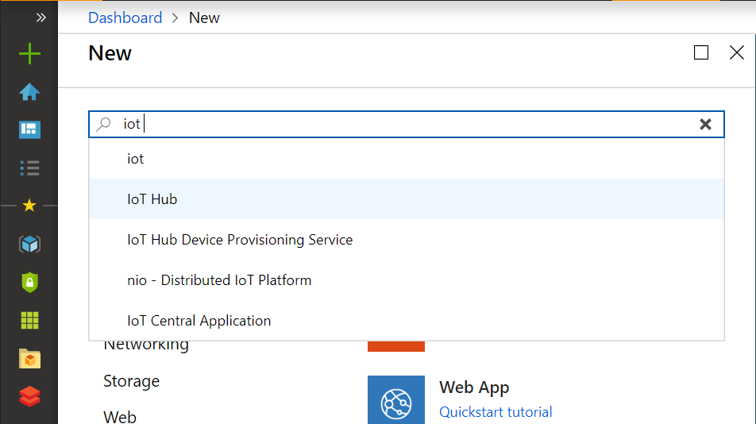
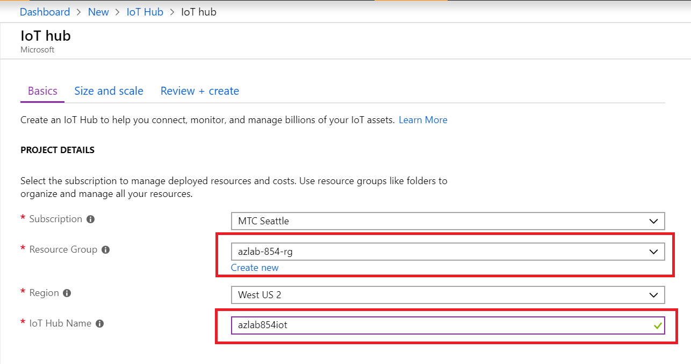
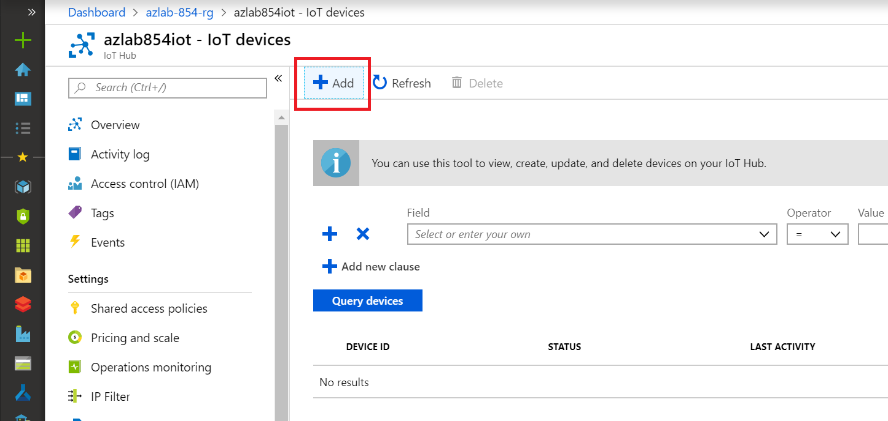
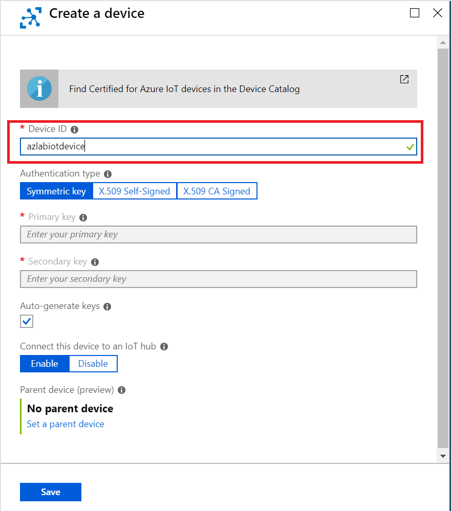
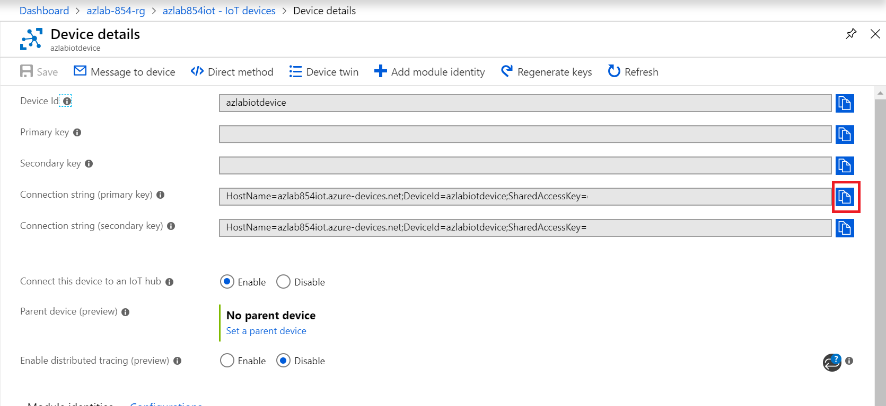

# Create IoT Hub












```
[Net.ServicePointManager]::SecurityProtocol = [Net.SecurityProtocolType]::Tls12
wget -Uri https://github.com/Azure-Samples/azure-iot-samples-python/archive/master.zip -OutFile C:\Users\azureadmin\Downloads\iotdevice.zip -Method Get
```

```
git clone https://github.com/Azure-Samples/azure-iot-samples-python.git
```

```json
{
    "eventtype": "sort",
    "bagid": "12592",
    "partnerid": "fra",
    "employeeid": "ARTHUR",
    "storeid": "bellevue",
    "pipeevent": {
      "pipeid": "woman",
      "captureddatetime": "2019-02-28 22:24:17.971181"
    },
    "EventProcessedUtcTime": "2019-02-28T22:24:23.8277256Z",
    "PartitionId": 0,
    "EventEnqueuedUtcTime": "2019-02-28T22:24:17.9670000Z",
    "IoTHub": {
      "MessageId": null,
      "CorrelationId": null,
      "ConnectionDeviceId": "azlabiotdevice",
      "ConnectionDeviceGenerationId": "636869773787747137",
      "EnqueuedTime": "2019-02-28T22:24:17.9570000Z",
      "StreamId": null
    }
```
