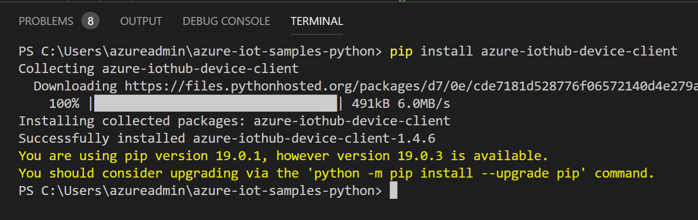

# Create Simulation Device

## Copy IoT device sample code (python)

### Login 'azlab###wvm'

Access to azlab###wvm using remote desktop app and use id and password
> 
> |ID|PW|
> |---|---|
> |azureadmin|********|

### Run IoT Device Sample 

1. Open Visual Studio Code and create new file

1. Copy the sample code from [IoT Device Sample (Python)](https://raw.githubusercontent.com/xlegend1024/az-iot-lab/master/AzureIoTDevice/simluatedDevice.py) and pate it to VS Code

1. Update connection string in line 20

1. Install IoT Device python library

```python
pip install azure-iothub-device-client
```



1. Run the code

```python
python SimulatedDevice.py
```

### Read the telemetry from your hub

1. Go back to Azure portal

2. Run following commands from Cloud Shell

```bash
az extension add --name azure-cli-iot-ext
az iot hub monitor-events --hub-name YourIoTHubName --device-id MyPythonDevice
```

> Please DO NOT stop the simulated device python sample for next lab