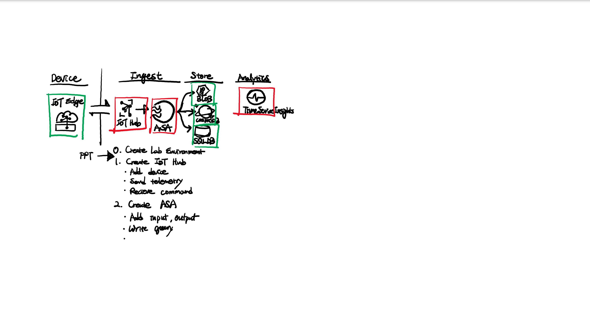

# Microsoft Azure IoT Hands-on Lab

## Architecture



## Setup Hands-on Lab Environment

## [00. Create lab environment](https://github.com/xlegend1024/az-iot-hol/blob/master/00CreateLab.md)

> __Login Windows Server Virtual Machine for rest of Labs__ from now here
>
> Login Windows Server VM and open browser, go to [Azure IoT Hands-on Lab](https://aka.ms/mtcs-iotlab)
>
> Login [Azure Portal](https://portal.azure.com) inside of the VM

## 01. Create Cloud Gateway

Login Windows Server VM, "**azlab###wvm**" and __Download__ the sample project from [here](https://github.com/xlegend1024/az-iot-hol/raw/master/AzureIoTDevice/azure-iot-samples-node-master.zip).

### Lab 1. Create Azure IoT Hub

Create Cloud Gateway for a IoT Solution

### [Lab 2. Device-to-Cloud (D2C)](https://docs.microsoft.com/en-us/azure/iot-hub/quickstart-send-telemetry-node)

Authenticate your device application and send data

## 02. Time Serise Insight

Let's see what kind of data comes from the device

### Lab 3. Create Time Serise Insight and Visualize data

Create Real-time Dashboard

### [Lab 4. Cloud-to-Device (C2D)](https://docs.microsoft.com/en-us/azure/iot-hub/quickstart-control-device-node)

Commanmd and control your device

## 03. IoT Edge

### [Lab 5. Deploy IoT Edge](https://docs.microsoft.com/en-us/azure/iot-edge/quickstart-linux)

[To install IoT Edge Runtime](https://docs.microsoft.com/en-us/azure/iot-edge/how-to-install-iot-edge-linux)

## 04. Real-time Analytics

Analyze stream data in real-time

### Lab 6. Create Azure Stream Analytics Jobs

Input/Output Names:

|Resource|Alias Name|
|---|---|
|Azure IoT Hub|iothub|
|Azure Cosmos DB|cosmosdb|
|Azure Storage Account(Blob)|blob|
|SQL Databse.tbl10mperf|tbl10mperf|
|SQL Database.tblworklogs|tblworklogs|
|SQL Database.tblbagevent|tblbagevent|

> To save logs in Blob, use following sample

```json
{datetime:yyyy}/{datetime:MM}/{datetime:dd}/{datetime:HH}/{datetime:mm}
```

1. To store raw data To:

* Use CosmosDB and Blob
* Store recored by recored

1. To store aggregated data

* Use SQL Database
* 10 minutes aggregation

1. Use Stream Analytics Query with following

[Stream Analytics Query](https://raw.githubusercontent.com/xlegend1024/az-iot-lab/master/StreamAnalyticJobs/productionline.sql)

---